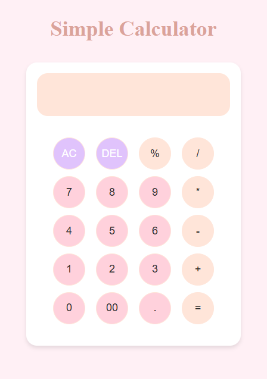

# Simple Calculator

A basic calculator app built with **HTML**, **CSS**, and **JavaScript**. Perform simple arithmetic operations like addition, subtraction, multiplication, division and modulus.

## Features
- Addition, subtraction, multiplication, division and modulus operations.
- Delete button (Del) for removing the last digit.
- All Clear (AC) button to reset everything.
- Responsive design for better usability.

## How to Run
1. Clone the repository or download the files.
2. Open the `index.html` file in your browser.
3. Start performing calculations!

## Technologies Used
- **HTML**: Markup for the calculator layout.
- **CSS**: Styling for buttons and display.
- **JavaScript**: Logic for performing calculations.

## Screenshot

 